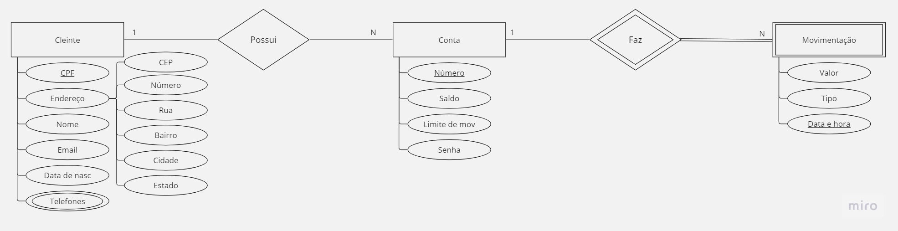
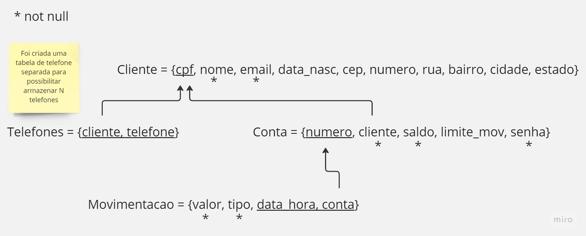

# Desafio de Estágio BTG - Modelagem de Banco de Dados Relacional

## Introdução

Bem-vindo(a) ao desafio de estágio no processo do BTG! Neste repositório será desenvolvido um banco de dados relacional com informações importantes sobre três entidades: cliente, conta e movimentação (depósitos e saques).

### Artefatos a serem entregues

Temos 4 artefatos que devem ser entregues:

1. **Diagrama Entidade Relacionamento:** Representação gráfica da estrutura das entidades e suas conexões.

2. **Modelo Entidade Relacionamento:** Descrição detalhada da estrutura das entidades, incluindo atributos e relacionamentos.

3. **Scripts DDL e DML (opcional para front-end):** Comandos para criação do banco de dados (Data Definition Language) e inserção de dados (Data Manipulation Language).

4. **API (opcional para front-end):** Desenvolvimento de uma API com as seguintes funcionalidades:
   - Cadastro/atualização de contas e clientes.
   - Cadastro de movimentações.
   - Consulta por conta/cliente.
   - Consulta por movimentações de uma conta.

## Modelagem do banco de dados

Após uma breve análise foi possível chegar a conclusão de quais dados devem ser armazenados para cada entidade e quais as entidades que serão criadas para esse banco de dados. As entidades serão: cliente, conta e movimentação, sendo que a movimentação é uma entidade que deriva do relacionamento entre contas, ou seja, as relações que geram os depósitos e saques.

### Dados das Entidades

#### Cliente:

Para o cliente, serão armazenados os seguintes dados:

- **CPF:** string (chave primária)
- **Nome completo:** string
- **Endereço:** atributo composto
- **Email:** string
- **Data de nascimento:** string
- **Telefones de contato:** multivalorado

O cliente é uma entidade forte, ou seja, independe das outras para existir, possuindo sentido por si só.

#### Conta:

Os dados essenciais a serem armazenados para a conta são:

- **Número da conta:** chave primária
- **Saldo:** big decimal
- **Limite de movimentação:** big unsigned decimal
- **Senha:** string

A conta também será uma entidade forte.

#### Movimentações:

A entidade "Movimentações" é a menos complexa do banco de dados e contém os seguintes atributos:

- **Valor da movimentação:** big decimal
- **Tipo da movimentação:** string pré-definida (saque, depósito)
- **Data e hora da movimentação:** string

Essa entidade é fraca, possuindo sentido apenas se existirem contas, pois só existem movimentações se também houver contas.

## Diagramas
### MER
Para a construção do MER (Modelo Entidade Relacionamemto) foram considerados os dados falados anteriormente, assim, foi possível chegar no seguinte modelo:



***Cliente:***
Analisando o modelo desenvolvido, podemos ver que o cliente possui os seguintes atributos:

1. **CPF:** chave primária
2. **Endereço:** atributo composto (pode ser derivado em CEP, número da casa, rua, bairro, cidade e estado)
3. **Nome**
4. **Email**
5. **Data de nascimento**
6. **Telefones de contato:** atributo multivalorado (pode ser um array com vários valores)

O cliente possui uma relação de 1 para N com as contas, ou seja, um cliente pode ter uma ou mais contas.

***Conta:***
A entidade "Conta" possui os seguintes atributos:

1. **Número da conta:** chave primária
2. **Saldo**
3. **Limite de movimentação**
4. **Senha**

A conta possui um relacionamento de 1 para N com a entidade "Movimentação". Lembrando que a movimentação é uma entidade fraca em relação à conta.

***Movimentação:***
A entidade "Movimentação" possui os seguintes atributos:

1. **Valor movimentado**
2. **Tipo de movimentação**
3. **Data e hora da movimentação:** chave primária (além do número da conta, que será necessário, já que a movimentação está ligada a uma conta)

Com isso, temos uma representação básica do nosso banco de dados e o seu funcionamento, facilitando o seu desenvolvimento mais a frente.

### DER
Após a criação do MER foi criado o DER (Diagrama de entidade relacionamento), o qual mostrará mais claramente como o banco irá ser montado.


Com esse diagramas podemos chegar a uma forma mais completa do nosso banco:

***Cliente:***
- **CPF:** chave primária
- **Nome:** não nulo
- **Email:** não nulo
- **Endereço:** opcional (depende dos serviços utilizados)
- **Data de nascimento:** opcional (depende dos serviços utilizados)

A tabela de cliente possui uma diferença entre o Modelo Entidade-Relacionamento (MER) e o Diagrama Entidade-Relacionamento (DER). No DER, o atributo telefones não aparece diretamente na tabela de cliente, pois, sendo um atributo multivalorado, foi escolhido criar uma tabela separada para melhor manipulação. Assim, cada cliente pode ter um ou mais telefones. A tabela telefone possui uma chave composta, em que o CPF do cliente é uma chave estrangeira ligada ao cliente e o telefone é o próprio número de telefone.

***Conta:***
- **Número da conta:** chave primária
- **CPF do cliente:** chave estrangeira ligada à tabela cliente (garante que a conta está associada a um cliente existente)
- **Saldo:** não nulo
- **Senha:** não nula

A tabela de conta possui uma chave primária e uma chave estrangeira relacionada à tabela cliente através do CPF, que é a chave primária do cliente. Além disso, os atributos cliente, saldo e senha não podem ser nulos.

***Movimentações:***
- **Data e hora da movimentação:** chave composta (juntamente com o número da conta)
- **Número da conta:** chave estrangeira ligada à tabela conta (garante que a movimentação está associada a uma conta existente)

A tabela de movimentações possui uma chave composta, onde a data e hora da movimentação e o número da conta formam a chave primária. O número da conta é uma chave estrangeira, que está ligada à tabela de conta.

## DDL e DML
Nesse tópico será comentado o desenvolvimento dos códigos DDL e DML.

### DDL (Data Definition Language)
São os comandos que interagem com os objetos do banco. EX: CREATE, ALTER e DROP.
Para isso foram criados os códigos que criam as tabelas utilizadas: cliente, conta, telefones e movimentacao, o qual pode ser encontrado na pasta */ddl_dml/ddl.sql*.

Nesse código foi criado as tabelas e utilizado os *constraints* para manutenção dos dados e para especificação de algumas regras, como por exemplo:
```sql
CONSTRAINT pk_telefones PRIMARY KEY (cliente_tel, telefone),
CONSTRAINT fk_telefones FOREIGN KEY (cliente_tel) REFERENCES cliente (cpf) ON DELETE CASCADE
```
que está na tabela de telefones e define a chave primária composta na primeira linha e define também que _cliente_tel_ se referencia à tabela de clientes pelo atributo cpf, além de definir que ao excluir um cliente, o telefone em que é referenciado à ele também deve ser excluido (*ON DELETE CASCADE*).

Um outro constraint pouco diferente que foi utilizado foi na tabela de movimentações, que define que o tipo deve ser apenas 's' ou 'd' (saque ou depósito):
```sql
CONSTRAINT tipo_movimentacao CHECK (LOWER(tipo) IN ('d', 's')),
```

Esses foram so constraints mais usados ao  longo do código.

### DML (Data Manipulation Language) 
São os comandos que interagem com os dados dentro das tabelas. EX: INSERT, DELETE e UPDATE. 
Para isso foram criados códigos que inserem, atualizam e excluem dados das tabelas, e pode ser encontrado na pasta */ddl_dml/dml.sql*

Para esse código não há nada a comentar mais profundamente, já que é apenas consultas, inserções e atualizações feitas para teste.

## API
### Preparando o ambiente
Primeiro é necessário instalar o postgresql, o qual foi o banco de dados relacional utilizado para o desenvolvimento do desafio:
```bash
sudo apt-get -y install postgresql
```
Após isso, é indispensável instalar o mysqlclient e o psycopg2 (biblioteca do python utilizado para acessar o banco):
```bash
pip3 install mysqlclient
pip3 install psycopg2
```
Com isso, é possível instalar a última biblioteca utilizada para mapear as tabelas e rodar as query's, sqlalchemy:
```bash
pip install flask psycopg2-binary SQLAlchemy
pip install Flask-SQLAlchemy
```
Ao final desses passos, o ambiente deve estar tudo ok, assim, basta apenas iniciar o servico do postgresql:
```bash
sudo service postgresql start
```
Além disso, vale lembrar que deve ser configurado o arquivo *api/config.py*:
```python
DATABASE = 'nome_banco_dados'
DATABASE_USERNAME = 'nome_usuario'
DATABASE_PASSWORD = 'senha_usuario'
DATABASE_HOST = 'localhost'
DATABASE_PORT = 5432
```
sendo que, localhost e porta é onde o serviço inicializado do postgresql está rodando (esse caminho é o padrão).

Prontinho! Já é possível rodar o servidor.

### Rodar o servidor
Depois de configurar o ambiente é possível rodar o servidor, assim é necessário, primeiramente, baixar esse código fonte e já possuir o python3 atualizado. Após isso, basta entrar na pasta *api* e rodar:
```bash
python3 run.py
```
O serviço rodará no localhost, porta 5000, é para lá que devem ser mandadas as requisições.

Se for necessário rodar o DDL e o DML para criar as tabelas e fazer algumas inserções, exclusões e atualizações basta rodar:
```python
python3 run_ddl_dml.py
```

# Documentação

## Documentação API telefones
### Listar telefones
**Descrição:** Esta rota permite listar todos os telefones cadastrados no sistema.

**Método HTTP:** GET

**URL:** ```/api/telefones```

**Resposta:**

* Código de status: 200 (OK)
* Corpo da resposta: Uma lista de objetos JSON representando os telefones cadastrados.

**Exemplo de resposta:**

```json
[
  {
    "cliente_tel": "12345678900",
    "telefone": "11987654321"
  },
  {
    "cliente_tel": "98765432100",
    "telefone": "21987654321"
  }
]
```

### Obter Telefone por CPF
**Descrição:** Esta rota permite obter os telefones associados a um cliente específico, identificado pelo seu CPF.

**Método HTTP:** GET

**URL:** ```/api/telefones/<cpf>```

**Parâmetros:**

* `<cpf>`: O CPF do cliente pelo qual se deseja obter os telefones.

**Resposta:**
* Código de status: 200 (OK) se os telefones forem encontrados, ou 404 (Não encontrado) se nenhum telefone estiver associado ao cliente informado.
* Corpo da resposta: Uma lista de objetos JSON representando os telefones do cliente.

**Exemplo de resposta (sucesso):**
```json
[
  {
    "cliente_tel": "12345678900",
    "telefone": "11987654321"
  },
  {
    "cliente_tel": "12345678900",
    "telefone": "11912345678"
  }
]
```

**Exemplo de resposta (falha):**
```json
{
  "message": "Telefone(s) não encontrado(s)."
}
```

### Inserir Telefone
**Descrição:** Esta rota permite inserir um novo telefone associado a um cliente.

**Método:** POST

**URL:** ```/api/telefones```

**Corpo da Requisição (em formato JSON):**
```json
{
  "cliente_tel": "12345678900",
  "telefone": "11987654321"
}
```

**Resposta:** 
* Código de status: 201 (Criado) se o telefone for inserido com sucesso, 400 ou 500 se houve algum erro.
* Corpo da resposta: retorna error se houve um erro com uma mensagem ou message com uma mensagem se tudo ocorreu ok

**Exemplo de resposta (sucesso):**
```json
{
  "message": "Telefone inserido com sucesso"
}
```

**Exemplo de resposta (falha):**
```json
{
  "error": "cliente_tel e telefone são campos obrigatórios"
}
```

### Atualizar Telefone
**Descrição:** Esta rota permite atualizar o número de telefone associado a um cliente específico.

**Método HTTP:** PUT

**URL:** ```/api/telefones/<tel_antigo>```

**Parâmetros:**

* `<tel_antigo>`: O número de telefone atual que se deseja atualizar.

**Corpo da Requisição (em formato JSON):**

```json
{
  "cliente_tel": "123.456.789-00",
  "telefone": "11912345678"
}
```

**Resposta:**

* Código de status: 200 (OK) se o telefone for atualizado com sucesso.
* Corpo da resposta: Uma mensagem de sucesso.

**Exemplo de resposta (sucesso):**
```json
{
  "message": "Telefone atualizado com sucesso"
}
```

**Exemplo de resposta (falha):**
```json
{
  "error": "É necessário mandar o telefone novo, o antigo (url) e o cpf do cliente"
}
```

### Excluir Telefone
**Descrição:** Esta rota permite excluir um telefone associado a um cliente específico na base de dados do sistema.

**Método HTTP:** DELETE

**URL:** ```/api/telefones/<cliente_tel>/<telefone>```

**Parâmetros da URL:**

* `<cliente_tel>`: O CPF do cliente dono do telefone que se deseja excluir.
* `<telefone>`: O número de telefone que deseja excluir.

**Resposta:**

* Código de status: 200 (OK) se o telefone for excluído com sucesso ou 400 se o telefone não for encontrado.
* Corpo da resposta: Uma mensagem de sucesso ou erro.

**Exemplo de resposta (sucesso):**
```json
{
  "message": "Telefone excluído com sucesso"
}
```

**Exemplo de resposta (falha):**
```json
{
  "error": "Telefone não encontrado"
}
```

## Documentação API movimentações

### Listar Movimentações
**Descrição:** Esta rota permite listar todas as movimentações registradas no sistema.

**Método HTTP:** GET

**URL:** ```/api/movimentacoes```

**Resposta:**

* Código de status: 200 (OK)
* Corpo da resposta: Uma lista de objetos JSON representando as movimentações registradas.

**Exemplo de resposta:**
```json
[
  {
    "data_hora": "2023-07-30 09:15:00",
    "conta_mov": 12345,
    "valor": 100.00,
    "tipo": "d"
  },
  {
    "data_hora": "2023-07-30 13:30:00",
    "conta_mov": 54321,
    "valor": 50.00,
    "tipo": "s"
  }
]
```

### Obter Movimentações de uma Conta
**Descrição:** Esta rota permite obter todas as movimentações associadas a uma conta específica.

**Método HTTP:** GET

**URL:** ```/api/movimentacoes/<conta>```

**Parâmetros:**

* `<conta>`: O número da conta pela qual se deseja obter as movimentações.

**Resposta:**
* Código de status: 200 (OK) se as movimentações forem encontradas, ou 404 (Não encontrado) se nenhuma movimentação estiver associada à conta informada.
* Corpo da resposta: Uma lista de objetos JSON representando as movimentações da conta.

**Exemplo de resposta (sucesso):**
```json
[
  {
    "data_hora": "2023-07-30T09:15:00",
    "conta_mov": 12345,
    "valor": 100.00,
    "tipo": "d"
  },
  {
    "data_hora": "2023-07-30T13:30:00",
    "conta_mov": 12345,
    "valor": 50.00,
    "tipo": "s"
  }
]
```

**Exemplo de resposta (falha):**
```json
{
  "error": "Movimentação(s) não encontrada(s)."
}
```

### Inserir Movimentação
**Descrição:** Esta rota permite criar uma nova movimentação associada a uma conta.

**Método HTTP:** POST

**URL:** ```/api/movimentacoes```

**Corpo da Requisição (em formato JSON):**
```json
{
  "data_hora": "2023-07-30T09:15:00",
  "conta_mov": 12345,
  "valor": 100.00,
  "tipo": "d"
}
```

**Resposta:**
* Código de status: 201 (Criado) se a movimentação for inserida com sucesso.
* Corpo da resposta: Uma mensagem de sucesso.

**Exemplo de resposta (sucesso):**
```json
{
  "message": "Movimentação inserida com sucesso"
}
```

**Exemplo de resposta (falha):**
```json
{
  "error": "data_hora, conta_mov, valor e tipo são campos obrigatórios"
}
```

### Atualizar Movimentação
**Descrição:** Esta rota permite atualizar o valor e/ou o tipo de uma movimentação específica.

**Método HTTP:** PUT

**URL:** ```/api/movimentacoes/<data_hora>/<conta_mov>```

**Parâmetros:**

* `<data_hora>`: A data e hora da movimentação que se deseja atualizar.
* `<conta_mov>`: O número da conta da movimentação que se deseja atualizar.

**Corpo da Requisição (em formato JSON):**
```json
{
  "valor": 120.00,
  "tipo": "s"
}
```

**Resposta:**
* Código de status: 200 (OK) se a movimentação for atualizada com sucesso.
* Corpo da resposta: Uma mensagem de sucesso.

**Exemplo de resposta (sucesso):**
```json
{
  "message": "Movimentação atualizada com sucesso"
}
```

**Exemplo de resposta (falha):**
```json
{
  "error": "É necessário mandar a data_hora, conta_mov, novo valor e novo tipo"
}
```

### Excluir Movimentação
**Descrição:** Esta rota permite excluir uma movimentação bancária na base de dados do sistema.

**Método HTTP:** DELETE

**URL:** ```/api/movimentacoes/<data_hora>/<conta_mov>```

**Parâmetros da URL:**

* `<data_hora>`: A data e hora da movimentação que se deseja excluir.
* `<conta_mov>`: O número da conta associada à movimentação que se deseja excluir.

**Resposta:**

* Código de status: 200 (OK) se a movimentação for excluída com sucesso.
* Corpo da resposta: Uma mensagem de sucesso.

**Exemplo de resposta (sucesso):**
```json
{
  "message": "Movimentação excluída com sucesso"
}
```

**Exemplo de resposta (falha):**
```json
{
  "error": "Movimentação não encontrada"
}
```

## Documentação API cliente

### Listar Clientes

**Descrição**: Esta rota permite listar todos os clientes cadastrados no sistema.

**Método HTTP**: GET

**URL**: `/api/clientes`

**Resposta**:
* Código de status: 200 (OK)
* Corpo da resposta: Uma lista de objetos JSON representando os clientes cadastrados.

**Exemplo de resposta**:
```json
[
  {
    "cpf": "123.456.789-00",
    "nome": "João Silva",
    "email": "joao@example.com",
    "data_nasc": "1990-01-15",
    "cep": "12345-678",
    "numero_casa": 100,
    "rua": "Rua das Flores",
    "bairro": "Centro",
    "cidade": "São Paulo",
    "estado": "SP"
  },
  {
    "cpf": "987.654.321-00",
    "nome": "Maria Souza",
    "email": "maria@example.com",
    "data_nasc": "1985-05-20",
    "cep": "54321-876",
    "numero_casa": 50,
    "rua": "Avenida dos Bandeirantes",
    "bairro": "Bela Vista",
    "cidade": "Rio de Janeiro",
    "estado": "RJ"
  }
]
```

### Obter Cliente por Parâmetro
**Descrição:** Esta rota permite obter cliente(s) com base em um parâmetro (nome, email ou cpf).

**Método HTTP:** GET

**URL:** ```/api/clientes/<parametro>```

**Parâmetros:**

* `<parametro>`: O valor do parâmetro pelo qual se deseja obter o(s) cliente(s), pode ser nome (substring, pode retornar mais de um cliente), cpf ou email (os dois últimos devem ser completos, retornando apenas um cliente).

**Resposta:**

* Código de status: 200 (OK) se o(s) cliente(s) for(em) encontrado(s), ou 404 (Não encontrado) se nenhum cliente estiver associado ao parâmetro informado.
* Corpo da resposta: Uma lista de objetos JSON representando o(s) cliente(s) encontrado(s).
Exemplo de resposta (sucesso):

```json
[
  {
    "cpf": "123.456.789-00",
    "nome": "João Silva",
    "email": "joao@example.com",
    "data_nasc": "1990-01-15",
    "cep": "12345-678",
    "numero_casa": 100,
    "rua": "Rua das Flores",
    "bairro": "Centro",
    "cidade": "São Paulo",
    "estado": "SP"
  }
]
```

**Exemplo de resposta (falha):**
```json
{
  "message": "Cliente(s) não encontrado."
}
```

### Inserir Cliente
**Descrição:** Esta rota permite criar um novo cliente e salvá-lo no banco de dados.

**Método HTTP:** POST

**URL:** ```/api/clientes```

**Corpo da Requisição (em formato JSON):**
```json
{
  "cpf": "123.456.789-00",
  "nome": "João Silva",
  "email": "joao@example.com",
  "data_nasc": "1990-01-15",
  "cep": "12345-678",
  "numero_casa": 100,
  "rua": "Rua das Flores",
  "bairro": "Centro",
  "cidade": "São Paulo",
  "estado": "SP"
}
```

**Resposta:**

* Código de status: 201 (Criado) se o cliente for criado com sucesso.
* Corpo da resposta: Uma mensagem de sucesso.

**Exemplo de resposta (sucesso):**
```json
{
  "message": "Cliente criado com sucesso"
}
```

**Exemplo de resposta (falha):**
```json
{
  "error": "cpf, nome e email são campos obrigatórios"
}
```

### Atualizar Cliente
**Descrição:** Esta rota permite atualizar os dados de um cliente específico.

**Método HTTP:** PUT

**URL:** /api/clientes/<cpf>

**Parâmetros:**

* `<cpf>`: O CPF do cliente que se deseja atualizar.

**Corpo da Requisição (em formato JSON):**
```json
{
  "nome": "João Silva",
  "email": "joao@example.com",
  "data_nasc": "1990-01-15",
  "cep": "12345-678",
  "numero_casa": 120
}
```

**Resposta:**

* Código de status: 200 (OK) se o cliente for atualizado com sucesso.
* Corpo da resposta: Uma mensagem de sucesso.

**Exemplo de resposta (sucesso):**
```json
{
  "message": "Cliente atualizado com sucesso"
}
```

**Exemplo de resposta (falha):**
```json
{
  "error": "Cliente não encontrado"
}
```

### Excluir Cliente
**Descrição:** Esta rota permite excluir um cliente da base de dados do sistema.

**Método HTTP:** DELETE

**URL:** ```/api/clientes/<cpf>```

**Parâmetros da URL:**

* `<cpf>`: O CPF do cliente que se deseja excluir.

**Resposta:**

* Código de status: 200 (OK) se o cliente for excluído com sucesso.
* Corpo da resposta: Uma mensagem de sucesso.

**Exemplo de resposta (sucesso):**
```json
{
  "message": "Cliente excluído com sucesso"
}
```

**Exemplo de resposta (falha):**
```json
{
  "error": "Cliente não encontrado"
}
```

## Documentação da API Contas

### Listar Contas

**Descrição**: Esta rota permite listar todas as contas cadastradas no sistema.

**Método HTTP**: GET

**URL**: `/api/contas`

**Resposta**:
* Código de status: 200 (OK)
* Corpo da resposta: Uma lista de objetos JSON representando as contas cadastradas.

**Exemplo de resposta**:
```json
[
  {
    "numero": 12345,
    "cliente_conta": "123.456.789-00",
    "saldo": 1000.00,
    "limite_mov": 2000.00
  },
  {
    "numero": 54321,
    "cliente_conta": "987.654.321-00",
    "saldo": 500.00,
    "limite_mov": 1000.00
  }
]
```

### Obter Conta por Parâmetro
**Descrição:** Esta rota permite obter uma conta ou contas com base em um parâmetro (número da conta ou CPF do cliente).

**Método HTTP:** GET

**URL:** ```/api/contas/<parametro>```

**Parâmetros:**

* `<parametro>`: O valor do parâmetro pelo qual se deseja obter a(s) conta(s), pode ser o numero da conta ou o cpf do cliente (no segundo caso pode retornar mais de uma conta).

**Resposta:**

* Código de status: 200 (OK) se a(s) conta(s) for(em) encontrado(s), ou 404 (Não encontrado) se nenhuma conta estiver associada ao parâmetro informado.
* Corpo da resposta: Uma lista de objetos JSON representando a(s) conta(s) encontrada(s).

**Exemplo de resposta (sucesso):**
```json
[
  {
    "numero": 12345,
    "cliente_conta": "123.456.789-00",
    "saldo": 1000.00,
    "limite_mov": 2000.00
  }
]
```

**Exemplo de resposta (falha):**
```json
{
  "message": "Conta(s) não encontrada."
}
```

### Inserir Conta
**Descrição:** Esta rota permite criar uma nova conta e salvá-la no banco de dados.

**Método HTTP:** POST

**URL:** ```/api/contas```

**Corpo da Requisição (em formato JSON):**
```json
{
  "numero": 12345,
  "cliente_conta": "123.456.789-00",
  "saldo": 1000.00,
  "limite_mov": 2000.00,
  "senha": "senha123"
}
```

**Resposta:**

* Código de status: 201 (Criado) se a conta for criada com sucesso.
* Corpo da resposta: Uma mensagem de sucesso.

**Exemplo de resposta (sucesso):**
```json
{
  "message": "Conta criada com sucesso"
}
```

**Exemplo de resposta (falha):**
```json
{
  "error": "numero, cliente_conta, saldo e senha são campos obrigatórios"
}
```

### Atualizar Conta
**Descrição:** Esta rota permite atualizar os dados de uma conta específica.

**Método HTTP:** PUT

**URL:** ```/api/contas/<numero>```

**Parâmetros:**

* `<numero>`: O número da conta que se deseja atualizar.

**Corpo da Requisição (em formato JSON):**
```json
{
  "saldo": 1200.00,
  "limite_mov": 2500.00
}
```

**Resposta:**

* Código de status: 200 (OK) se a conta for atualizada com sucesso.
* Corpo da resposta: Uma mensagem de sucesso.

**Exemplo de resposta (sucesso):**
```json
{
  "message": "Conta atualizada com sucesso"
}
```

**Exemplo de resposta (falha):**
```json
{
  "error": "Conta não encontrada"
}
```

### Excluir Conta
**Descrição:** Esta rota permite excluir uma conta bancária na base de dados do sistema.

**Método HTTP:** DELETE

**URL:** ```/api/contas/<numero>```

**Parâmetros da URL:**

* `<numero>`: O número da conta que se deseja excluir.

**Resposta:**

* Código de status: 200 (OK) se a conta for excluída com sucesso.
* Corpo da resposta: Uma mensagem de sucesso.

**Exemplo de resposta (sucesso):**
```json
{
  "message": "Conta excluída com sucesso"
}
```

**Exemplo de resposta (falha):**
```json
{
  "error": "Conta não encontrada"
}
```

# Conclusão e considerações
Para esse projeto foi desenvolvido um banco de dados relacional utilizando a linguagem de programação **python** e o banco **postgresql**. As bibliotecas utilizadas foram **psycopg2** e **sqlAlchemy** para manipulação dos dados no banco.

Para que isso fosse possível foi desenvolvido a modelagem do banco anteriormente, criando o modelo entidade relacionamento e o diagrama entidade relacionamento, e, também os códigos DDL e DML.

Ao final, foi possível obter um banco de dados funcional, porém, há algumas considerações que poderiam ser feitas mais a frente com a continuação do desenvolvimento:
1. **Encriptar a senha da conta:** isso deixa o sistema mais seguro
2. **Alterar o tipo de movimentação:** adicionar os tipos de pix, transferência bancária, etc, para que o servidor fique mais completo.
3. **Criação de mais rotas:** nesse momento existe apenas as rotas de CRUD das entidades, assim, para utilizar ele deverão ser feitas outras rotas, como, por exemplo, login na conta, fazer transferência etc.
